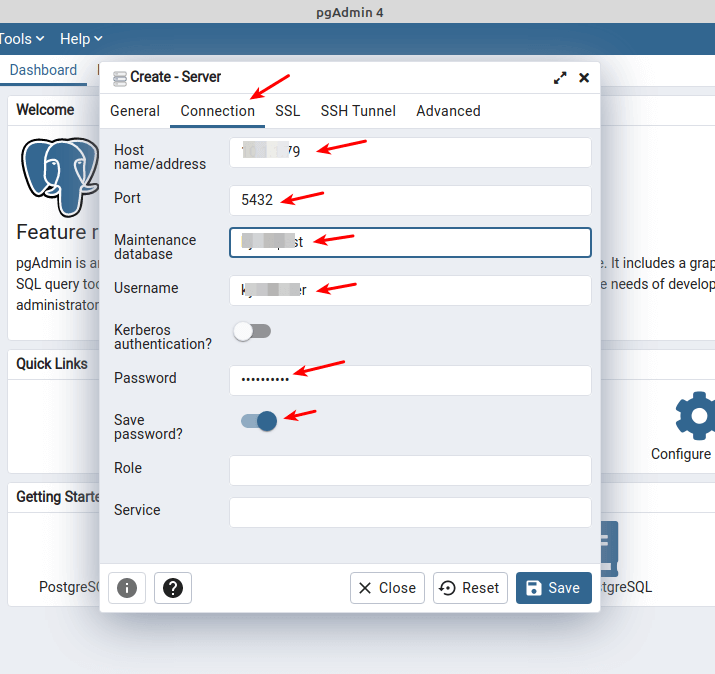
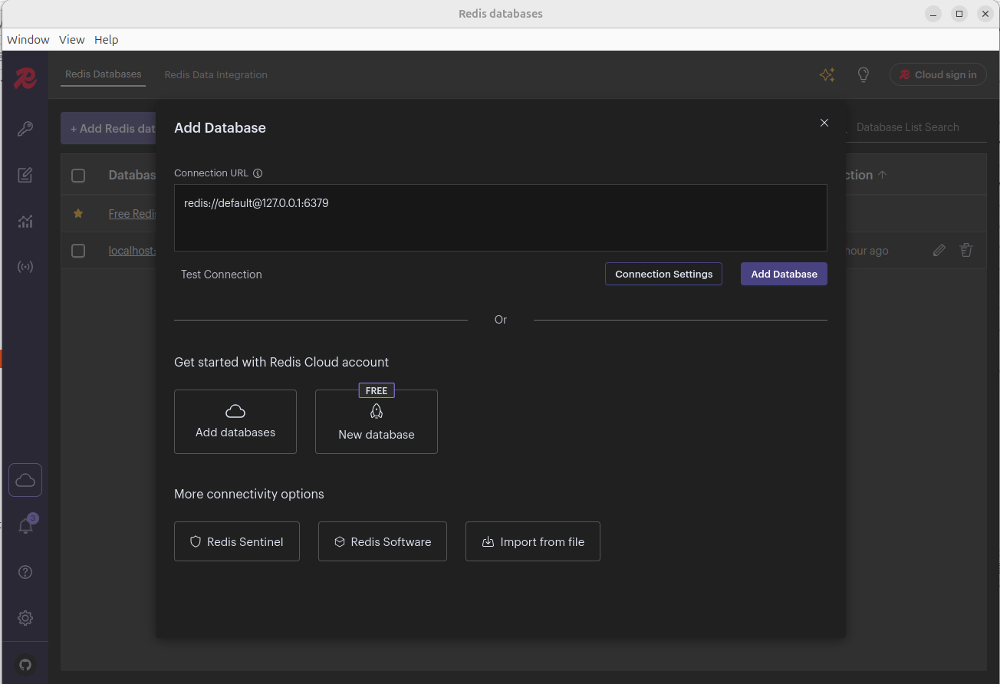
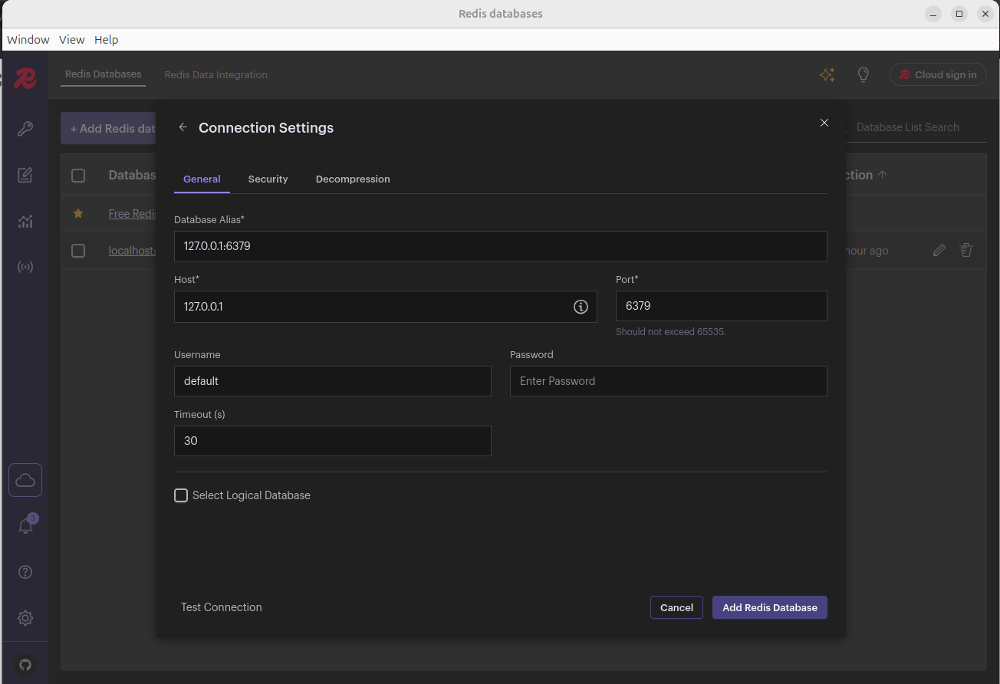
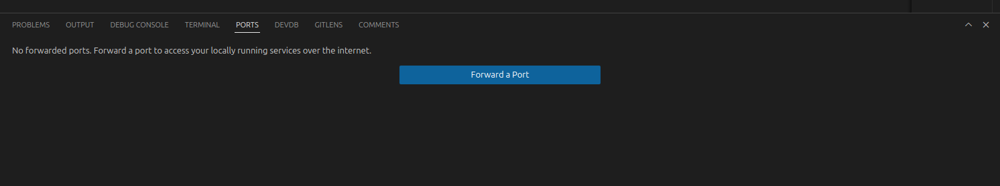
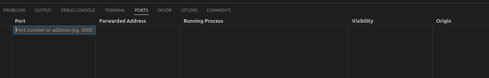
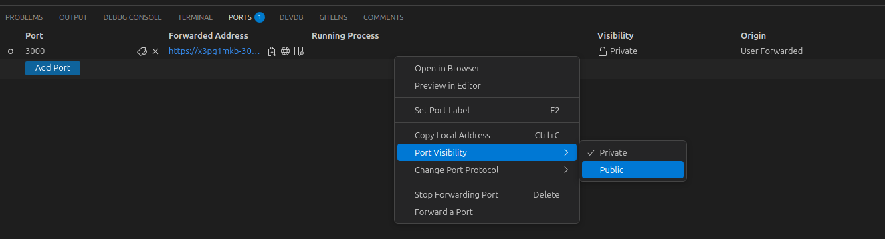

# Renivet Marketplace

Renivet Marketplace is a multi-vendor eco-friendly marketplace for clothing and goods. This project is built using the latest technologies to ensure high performance, scalability, and seamless user experience.

## 🚀 Tech Stack

### Frontend
- **Next.js 15.1.6** - React framework for server-side rendering and static site generation
- **React 19** - Frontend library for building UI components
- **Tailwind CSS 3.4.17** - Utility-first CSS framework for responsive design
- **ShadCN** - Pre-built UI components built on Radix UI
- **Radix UI** - Accessible components with headless UI functionality
- **Lucide Icons** - Beautiful open-source icon library
- **Embla Carousel** - Carousel and slider components for modern web apps
- **React Hook Form** - Form management with easy validation and state management
- **React Query** - State management and data fetching with caching capabilities
- **React Email** - Framework to build and send email templates with Resend
- **Tiptap 2.11.5** - Rich text editor with ProseMirror
- **Recharts** - Data visualization and charting library
- **Framer Motion** - Animation library for React

### Backend
- **Hono** - Lightweight, fast web framework for building APIs
- **Bun** - JavaScript runtime optimized for speed and performance
- **TRPC 11.0.0-rc.748** - End-to-end type-safe APIs
- **Drizzle ORM 0.37.0** - SQL ORM for PostgreSQL
- **PostgreSQL 3.4.5** - Relational database management system
- **Redis (Upstash + ioredis)** - Caching and session management
- **Resend 4.1.2** - Transactional email delivery service
- **Razorpay 2.9.5** - Payment gateway integration
- **Shiprocket API** - Shipment and order fulfillment services

### Authentication & Security
- **Clerk 6.11.1** - Authentication and user management system
- **JOSE 5.9.6** - JWT and cryptography utilities
- **Svix 1.45.1** - Webhook handling and delivery

### File Management
- **UploadThing 7.4.4** - Easy file uploads with built-in storage integrations
- **Sharp 0.33.5** - Image processing for optimized delivery

### Utilities
- **Zod 3.24.1** - Schema validation and parsing
- **PapaParse 5.5.2** - CSV data processing
- **Country-State-City 3.2.1** - Location data and APIs
- **SuperJSON 2.2.2** - JSON serialization and deserialization
- **Clsx 2.1.1** - Utility for conditional classNames
- **Date-fns 4.1.0** - Modern JavaScript date utility library
- **Cmdk 1.0.4** - Command menu for search and navigation
- **Enhanced-ms 3.1.0** - Enhanced time utility functions

### Dev Tools
- **TypeScript 5.7.3** - Type-safe JavaScript with strict typing
- **ESLint 8.57.0** - JavaScript/TypeScript linting for clean code
- **Prettier 3.4.2** - Code formatting with consistency
- **Drizzle Kit 0.29.1** - Migrations and schema management for Drizzle ORM
- **Tailwind Merge 2.6.0** - Smart merging of Tailwind classes
- **PostCSS 8.5.1** - CSS transformation and optimizations

## Project Structure

```
Directory structure:
└── renivet-it-renivet-marketplace/
    ├── drizzle/
    ├── public/
    └── src/
        ├── middleware.ts
        ├── actions/
        ├── app/
        │   ├── (auth)/
        │   │   └── auth/
        │   │       ├── forgot-password/
        │   │       │   ├── s1/
        │   │       │   └── s2/
        │   │       ├── signin/
        │   │       ├── signup/
        │   │       └── verify/
        │   ├── (home)/
        │   │   ├── about/
        │   │   ├── become-a-seller/
        │   │   ├── contact/
        │   │   ├── privacy/
        │   │   ├── refund-policy/
        │   │   ├── shipping-policy/
        │   │   └── terms/
        │   ├── (marketing)/
        │   │   ├── blogs/
        │   │   ├── brand-demo/
        │   │   ├── brands/
        │   │   ├── products/
        │   │   ├── shop/
        │   │   └── soon/
        │   ├── (protected)/
        │   │   ├── dashboard/
        │   │   │   ├── brands/
        │   │   │   │   └── [bId]/
        │   │   │   │       ├── analytics/
        │   │   │   │       ├── bans/
        │   │   │   │       ├── invites/
        │   │   │   │       ├── media/
        │   │   │   │       ├── members/
        │   │   │   │       ├── memberships/
        │   │   │   │       ├── page/
        │   │   │   │       ├── roles/
        │   │   │   └── general/
        │   │   │       ├── advertisements/
        │   │   │       ├── banners/
        │   │   │       ├── blogs/
        │   │   │       ├── brand-products/
        │   │   │       ├── brand-waitlist/
        │   │   │       ├── brands/
        │   │   │       ├── categories/
        │   │   │       ├── category-requests/
        │   │   │       ├── coupons/
        │   │   │       ├── marketing-strip/
        │   │   │       ├── orders/
        │   │   │       ├── plans/
        │   │   │       ├── privacy/
        │   │   │       ├── product-types/
        │   │   │       ├── products/
        │   │   │       ├── refund-policy/
        │   │   │       ├── roles/
        │   │   │       ├── shipping-policy/
        │   │   │       ├── shop-by-category/
        │   │   │       ├── sub-categories/
        │   │   │       ├── subscribers/
        │   │   │       ├── tags/
        │   │   │       ├── terms/
        │   │   │       ├── tickets/
        │   │   │       └── users/
        │   │   ├── i/
        │   │   ├── orders/
        │   │   └── profile/
        │   │       ├── addresses/
        │   │       ├── cart/
        │   │       ├── orders/
        │   │       ├── security/
        │   │       └── wishlist/
        │   └── api/
        │       ├── log-trpc/
        │       ├── permission/
        │       ├── trpc/
        │       ├── uploadthing/
        │       └── webhooks/
        │           ├── clerk/
        │           ├── razorpay/
        │           │   ├── payments/
        │           │   ├── refunds/
        │           │   └── subscriptions/
        │           └── shipping/
        ├── components/
        │   ├── about/
        │   ├── analytics/
        │   ├── blogs/
        │   ├── brand-demo/
        │   ├── brand-request/
        │   ├── brands/
        │   ├── contact/
        │   ├── dashboard/
        │   ├── globals/
        │   ├── home/
        │   ├── icons/
        │   ├── orders/
        │   ├── products/
        │   ├── profile/
        │   ├── providers/
        │   ├── shop/
        │   ├── soon/
        │   ├── svgs/
        │   ├── toolbars/
        │   └── ui/
        ├── config/
        ├── hooks/
        ├── lib/
        │   ├── builders/
        │   ├── db/
        │   ├── jose/
        │   ├── posthog/
        │   ├── razorpay/
        │   ├── redis/
        │   ├── resend/
        │   ├── shiprocket/
        │   ├── store/
        │   ├── trpc/
        │   ├── uploadthing/
        │   └── validations/
        └── types/

```

## 📦 Project Setup

### 1. Clone the Repository

```bash
git clone https://github.com/itsdrvgo/renivet-marketplace.git
cd renivet-marketplace
```

### 2. Install Dependencies

```bash
bun install # Use Bun to install dependencies (https://bun.sh/)
```

### 3. Set Environment Variables

```bash
cp .env.example .env.local
```

Copy paste the variables provided to you by our team in `.env.local`.

### 4. Setup AWS for local development

- Create a folder named `aws` in the root directory.
- Paste the `renivet-kp.pem` file in the `aws` folder.
- Open the bash and run the following command:
    ```bash
    ssh -i aws/renivet-kp.pem -fN -L 15432:localhost:5432 -L 16379:localhost:6379 ubuntu@13.126.5.179
    ```
    > This command will only work if you have any `bash` installed on your system. If you are using `git bash` then this command will work. If you are using `cmd` then you have to install `bash` on your system.
- This command will create a tunnel to the AWS server and you can access the database and Redis locally.
- If the file asks for elevated permissions, use `chmod 400 aws/renivet-kp.pem` to give the file the required permissions and then run the command again.

### 5. Start the Development Server

```bash
bun run dev
```
This will start the development server at `http://localhost:3000`.

> During development, if you get any error related to the database, i.e. `Connection refused`, then you have to run the command mentioned in step 4 again.

### 6. Build the Project

```bash
bun run build # Build the project for production
bun run start # Start the production server
```

## 🗂️ Database Migrations

Everytime you change an existing schema, i.e. add a new column, change the datatype of a column, etc., you have to create a new migration file, and push it to the database via Drizzle.

```bash
bun run db:mig
```

This will internally run the `bun run db:gen` and `bun run db:push` commands to first, generate the migration file and then push it to the database.

> While development, the migrations will only be pushed to the local database. For production, you have to set the production database URL in the `.env.local` file and then run the migration command.

## ✨ Email Development

To test the email templates locally, you can use the `bun run email:dev` command.

```bash
bun run email:dev
```

## 📚 Useful Commands

- `bun run dev` – Start development server
- `bun run build` – Build project for production
- `bun run start` – Start production server
- `bun run lint` – Run ESLint to check code quality
- `bun run db:gen` – Generate Drizzle ORM migration files
- `bun run db:push` – Push database changes
- `bun run db:mig` – Run migrations and apply changes
- `bun run email:dev` – Preview Resend emails locally

## 📢 API Endpoints

The API is built with tRPC. Endpoints are available at:

```
/src/lib/trpc/routes/[folder]/filename.ts
```

***
## 🛠️ Development Server Running Process

### 📌 Prerequisites
- [Node.js](https://nodejs.org/en/download/)
- [Bun](https://bun.sh/docs/installation)
- [pgAdmin](https://www.pgadmin.org/download/)
- [Redis Insight](https://redis.io/insight/)
- [VsCode](https://code.visualstudio.com/download)

### 📌 Steps to run the development server

> ### ⚡ Important Note
> - Note: Before doing this setps please follow the "Setup AWS for local development" section in the README.md file.
> - Make sure you run that script.

1. **[pgAdmin](https://www.pgadmin.org/download/)**
    - Open pgAdmin and create a new server.
    - Enter the following details:
    1. General:
        - Name: `renivetDev`

    

    2. Connection:
        - Host name/address: `localhost`
        - Port: `15432`
        - Username: `itsdrvgo`
        - Password: `itsdrvgo`

    

2. **[Redis Insight](https://redis.io/insight/)**
    - Open Redis Insight and create a new connection.

        

    - Enter the following details:
        - Host: `localhost`
        - Port: `16379`
        - Password: `itsdrvgo`

    

3. **[VsCode Port Forward](https://code.visualstudio.com/download)**
    - Open VsCode and navigate to port section from the terminal.

    

    - click the forward port button.
    - Enter the port number 3000 as our local development server is running on port 3000.

    

    - Right click on that created link make port visibility to public.

    

4. **[Clerk](https://clerk.com/)**
    - Log in to clerk.com using github account.
    - Copy the vscode port forward link from the terminal.
    - Click on the add endpoint button.
    - Paste the vscode port forward link in the URL field.
    - add this '/api/webhooks/clerk' at the end of the URL.
    - Subscribe to events; e.g. user.created, user.updated, user.deleted.
    - Click on the create endpoint button.
    > **Note**: You dont have access to the clerk dashboard then you have to contact the team and provide your vscode port forward link.

5. Run the development server
    - Open the terminal and run the following command:
    ```bash
    bun run dev
    ```
    - This will start the development server at `http://localhost:3000`.

