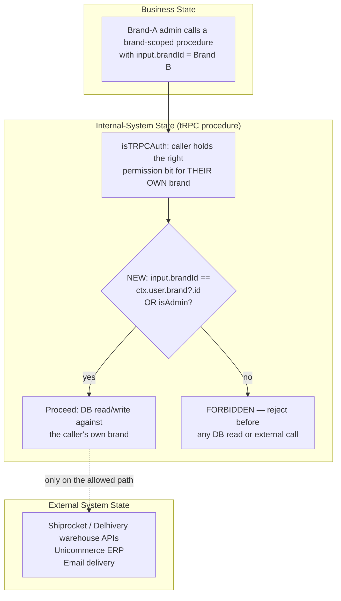

# Work Item
Linear ID: REN-172
Title: Cross-tenant authorization bypass across 51 brand-router procedures (includes F10's 6 Unicommerce procedures)
Branch: akshayatwork1/ren-172-cross-tenant-authorization-bypass-across-51-brand-router
State: CRITIQUE

# Risk
initial_risk: L3 (source: preliminary_ai)
path_rule_risk: L3 (matches `tenant-isolation` — `src/lib/trpc/routes/brands/**` — and `customer-pii` — `src/lib/trpc/routes/brands/confidential.ts` — in `path-risk-policy.yaml`)
semantic_risk: L3 (confirmed: full brand-takeover privilege-escalation chain, live PII/financial data leak)
final_risk: L3
Escalation history: none — L3 was the floor from CLASSIFIED onward.

# Problem / Objective
51 of 104 procedures in `src/lib/trpc/routes/brands/` gate only via `isTRPCAuth(..., "brand")` — which checks the caller's own permission bitfield — and never compare the target `input.brandId` against the caller's own brand. This includes a complete privilege-escalation chain (a Brand-A admin can grant themselves full `ADMINISTRATOR` rights over Brand B), a zero-auth confidential-KYC-data leak with live external side effects, and zero-auth analytics/shipment-PII leaks. The objective is to add the one correct, already-proven-in-this-codebase ownership check — `input.brandId !== ctx.user.brand?.id → FORBIDDEN` (with an `isAdmin` bypass) — to all 51 procedures, closing P08's F10 finding as a byproduct.

# Requirements
- REQ-001: Every one of the 51 procedures rejects a caller whose own brand ≠ target `brandId` (except a legitimate platform-admin bypass).
- REQ-002: `roles.ts`'s `createRole`/`updateRole` cannot write a permission bitfield for a brand other than the caller's own.
- REQ-003: `members.ts`'s `roles.updateRoles` cannot bind a role to a user in a brand other than the caller's own.
- REQ-004: `getBrandWithConfidential`/`confidential.ts` reject cross-brand calls before any KYC/bank data read or external side effect.
- REQ-005: `analytics.ts`'s 4 procedures and `orders.ts`'s `getOrderShipmentDetailsByShipmentId` reject cross-brand data requests.
- REQ-006: The 6 F10 Unicommerce procedures reject cross-brand calls (closes P08 AC-31 as a byproduct).
- REQ-007: `products.ts`'s 3-4 sites with the ownership check commented out have it restored (regression, not new work).

# Scope Contract
**In scope:** all 51 procedures per `qa/CROSS_TENANT_AUTHORIZATION_AUDIT.md`, the roles.ts/members.ts escalation chain, `getBrandWithConfidential`/`confidential.ts`, the zero-auth analytics/shipment leaks, F10's 6 Unicommerce procedures, and the products.ts regression.

**Out of scope:** `brands/support.ts` (confirmed already correct), `general/` admin routers (confirmed correct by design), P08 Epic work beyond F10 (remains unauthorized per Gate F), and any redesign of the underlying BitField permission system.

**Dependencies:** none blocking (this issue is explicitly cleared to proceed regardless of P08 authorization — Gate F). `REN-124` (IDOR test matrix) is an informational coordination point for test-infrastructure ownership, not a blocker.

**Assumptions:** the existing `products.ts`/`media.ts`/`support.ts`/`category-requests.ts` ownership-check pattern is the correct one to replicate; `isAdmin` is a legitimate, intentional bypass carried forward unchanged.

**Scope changes:** none yet.

# Decisions
- DEC-001 (status: **open**, non-blocking for approval): Is `qa/CROSS_TENANT_AUTHORIZATION_AUDIT.md`'s full 104-procedure enumeration still accurate for the ~40 procedures this pass did not individually re-verify (`brand-pages.ts`, `revenue.ts`, `invites.ts`, `bans.ts`)? Recommendation: trust the existing enumeration (git log shows zero commits touching those files since the audit); re-verify per-procedure at implementation time rather than gating approval on a full re-audit. Unlike REN-144's DEC-001, this one does not block Approval — see Approval section for why.

# Scenarios
See `work-item.yaml` `scenarios[]` (SCN-001 through SCN-008). Covers: authorization (generic pattern + F10-specific), the full escalation-chain exploit path, external-side-effect ordering, structural consistency of the fix across 51 sites, admin-bypass preservation, PII leak closure, and a reasoned exclusion of a dedicated concurrency test (justified inline, not just asserted).

# Invariants
See `work-item.yaml` `invariants[]` (INV-001 through INV-005): the general cross-tenant invariant, the two named severe chains, fix-consistency across all 51 sites, and admin-capability preservation.

# Flow Design

This is an authorization-gate fix, not a data-flow/state-machine change — no business-state transitions are introduced. The three-domain model's relevant content here is ordering, not synchronization:

## Synchronization failure handling
Not applicable in the retry/timeout sense. The one ordering guarantee this SPEC requires: the ownership check (I2) must execute before any external call (E1) or any read/write of the target brand's data (I3) — never after, never in parallel. This directly closes the `confidential.ts` finding where a rejected caller could otherwise still trigger a real Shiprocket/Delhivery warehouse-creation call.

## Reconciliation strategy
Not applicable — no eventual-consistency dimension exists in a synchronous authorization check.

# Repository Investigation

**1. What repository areas were investigated?** `brands.ts`, `roles.ts`, `members.ts`, `confidential.ts`, `analytics.ts`, `orders.ts` (brands), `products.ts` — each re-verified directly against `origin/master` on 2026-08-31, not trusted from the audit document alone.

**2. Why were those areas selected?** They are the files naming the most severe findings in the Wave-2 audit update (the escalation chain, the zero-auth leaks) plus the reference-pattern file (`products.ts`) whose own regression needed independent confirmation.

**3. What dependencies were discovered?** `REN-124` (IDOR test matrix) as a natural test-infrastructure coordination point; P08's F10/AC-31 closes as a byproduct of REQ-006.

**4. Which potentially related areas were intentionally excluded, and why?** `brands/support.ts` and `general/` admin routers — both independently confirmed correct-by-design in the original audit and not re-flagged by this pass's own spot checks. P08 Epic work beyond F10 — remains unauthorized (Gate F).

**5. Which external systems are involved?** Shiprocket, Delhivery (both via `confidential.ts`'s warehouse-creation side effect), Unicommerce (the 6 F10 procedures), and outbound email (verification emails).

**6. Which state transitions are affected?** None — this is a pure access-control gate, not a state machine.

**7. Which security/authorization boundaries are affected?** All of them — this work item's entire scope IS the tenant-isolation boundary. Every one of the 51 procedures is itself a security boundary under this fix.

**8. What assumptions remain unresolved?** Whether the ~40 procedures not individually re-verified this pass (in `brand-pages.ts`, `revenue.ts`, `invites.ts`, `bans.ts`) still match the audit's characterization — DEC-001, open but non-blocking (see Approval).

**9. Did investigation cause the risk level to change?** No — `tenant-isolation` already forced L3 at CLASSIFIED.

**10. Is there remaining uncertainty that could materially change the design?** No — DEC-001's possible answers ("the count is accurate" vs. "a few procedures drifted") change *which* procedures need the fix, not *what* the fix is or *how* it's verified. This is why DEC-001 does not block Approval here, unlike REN-144's DEC-001 which genuinely could change the architecture (whether to build new reconciliation tooling or integrate with an existing one).

# Architecture

**Revision 1 (post Critic Cycle 1).** The single blocking finding — one flat `requireOwnBrand(ctx, input.brandId)` signature presented as if it applied uniformly — is fixed below by splitting resolution from comparison, not by abandoning the shared-utility approach (which Cycle 1 confirmed is still correct in principle, per PAT-CONTRACT-01).

**One shared COMPARISON utility, with per-class RESOLUTION.** The comparison itself (`if (resolvedBrandId !== ctx.user.brand?.id && !isAdmin) throw new TRPCError({ code: "FORBIDDEN" })`, mirroring the exact boolean logic already live and correct in `products.ts`) is identical everywhere. What differs, and must be explicitly classified per procedure rather than assumed uniform, is how `resolvedBrandId` is obtained:

- **Class A — DIRECT (`input.brandId` present):** the majority of the 51 sites, including `brands.ts`'s 9 named procedures and the 6 F10 Unicommerce procedures. `resolvedBrandId = input.brandId`, checked immediately.
- **Class B — RESOLVED (target brand only knowable after an existing lookup):** verified at least 9 sites fall here — `members.ts`'s `roles.updateRoles` (`resolvedBrandId = (await userCache.get(input.userId)).brand.id`, reusing the exact lookup already present at members.ts:27-40 for its own `NOT_FOUND` check — no new lookup introduced), `orders.ts`'s `getOrderShipmentDetailsByShipmentId` (resolved via the shipment's own brand reference), all 6 `brand-pages.ts` procedures (resolved via the existing section/product lookup, verified at brand-pages.ts:27-34), and `products.ts`'s `updateProductJourney`/`updateProductValue`/`createProductJourney`/`createProductValue` (resolved via the journey/value record's own product→brand chain). In every Class B case verified, the resolution reuses a DB read the procedure was already performing for its own `NOT_FOUND` handling — the fix adds a comparison, not a new query.

`INV-004` (the "one consistent fix pattern" invariant) is revised to apply to the *comparison*, not the *resolution* — see `work-item.yaml`.

**products.ts gets two different fixes, not one (REQ-007, corrected).** Only `updateProductPublishStatus` needs its commented-out check restored (a true regression). `updateProduct`/`deleteProduct`'s commented blocks are dead code already superseded by working active checks — no change needed there. Five procedures (`updateCatalogQcReview`, `createProductJourney`, `updateProductJourney`, `createProductValue`, `updateProductValue`) need genuinely new authorization logic — two of them (Journey/Value) are Class B resolution sites per above.

**Observability addition (REQ-009).** Every `FORBIDDEN` rejection from the new check is logged via the existing operational-alert mechanism (the same `createOperationalAlert` helper referenced in REN-144's SPEC), so repeated post-deploy probing of this newly-closed chain is visible during rollout — cheap to add, meaningful for a P0 fix closing an actively-probeable full brand-takeover path.

**Ordering is the whole fix.** The check must run immediately after `isTRPCAuth`'s own permission-bit check and before any DB read of the target brand's data or any external API call — this is what closes the `confidential.ts` external-side-effect finding, not a separate mechanism.

**The escalation chain needs both links fixed, not just one.** Fixing only `createRole`/`updateRole` (REQ-002) without also fixing `members.ts`'s `roles.updateRoles` (REQ-003) would leave a brand-A admin able to create a hostile role but not bind it — technically "safe" but leaving a dangling half-fix that a future change could silently reopen. Both are required together, verified by the single chained scenario SCN-003, not two independent ones.

**F10 is closed by REQ-006 alone** — no separate implementation effort; the same shared utility applied to the 6 Unicommerce procedures satisfies P08's AC-31.

**Admin bypass is preserved, not re-derived.** `isAdmin` continues to mean whatever it already means in `products.ts`'s live pattern — this SPEC does not touch that definition, only replicates its use.

# Critic Review — Cycle 1 (2026-08-31)

Isolated Critic subagent (fresh context, read-only, verified claims directly against `origin/master`) returned verdicts for all 27 categories. **1 blocking finding** (`authorization`): the flat `requireOwnBrand(ctx, input.brandId)` signature didn't generalize to >=9 of the 51 sites lacking a direct `input.brandId`, and REQ-007 undercounted `products.ts`'s scope (only 1 of 6 vulnerable procedures is a true "restore" fix, 5 need new code). Both resolved in Revision 1 above (REQ-008's resolution-class split; REQ-007's corrected scope). Non-blocking refinements also applied: REQ-009/SCN-011 (observability), SCN-010/INV-006 (happy-path same-brand regression), a citation correction (roles.ts line numbers), and cross-tagging notes for PII/security-abuse follow-ups left for Test Design. Full per-category record in `work-item.yaml` `critic_findings[]`.

## Critic Cycle 2 (2026-08-31) — narrow corrections, architecture confirmed sound

Cycle 2 verified Revision 1 against `origin/master` directly. **The core architectural pivot (shared comparison + per-procedure resolution classification) is confirmed correct** and closes Cycle 1's blocking finding — Cycle 2 did not need to re-litigate it. But re-verifying every named site turned up three concrete, localized errors:

1. **`createBrandPageSection` was misclassified** as Class B (resolved) when it's actually Class A (direct `input.brandId`) — the citation pointed at a different procedure's lines.
2. **`updateProductJourney`/`updateProductValue`'s "no new query needed" claim was false** — their underlying tables have no brand reference at all (only a `productId` FK), so a genuine second lookup (fetch the journey/value row, then fetch that product for `.brand.id`) is required, not assumed free.
3. **A 10th Class B site was found**, `invites.ts`'s `getInvite` — in one of the exact files DEC-001 already flagged as not individually re-verified, corroborating that open decision with concrete evidence rather than leaving it purely hypothetical.

**Revision 2** corrects all three directly in REQ-008 (see `work-item.yaml`), plus adds a concrete alerting convention to REQ-009 (`entityType`/`entityId`/`dedupeKey` for `createOperationalAlert`, which Cycle 2 confirmed is real and workable but was under-specified). None of this required a redesign — Cycle 2's own recommendation was "narrow, mechanical corrections," which is what this revision is.

A third, final Critic cycle has been requested to confirm these corrections hold — this is Cycle 3 of the process's 3-cycle automatic cap, matching REN-144's pattern.

## Critic Cycle 3 (2026-09-01) — final cycle, all corrections confirmed

Cycle 3 independently re-verified all three of Revision 2's targeted corrections directly against `origin/master` and confirmed each **RESOLVED**: `createBrandPageSection` is genuinely Class A; the Journey/Value second-lookup requirement is genuinely necessary and valid as specified; `invites.ts::getInvite` resolves exactly as described. One more bookkeeping gap was found and fixed directly (3 more products.ts procedures belong in the Class B list — added) and one minor field was added to REQ-009's alert convention (`type: 'cross_brand_rejection'`) — neither rose to blocking, and Cycle 3's own recommendation was to proceed to Approval rather than a 4th cycle. Spot-checks of `revenue.ts` and `bans.ts` (files DEC-001 named as unverified) found no issues, corroborating DEC-001.

**DEC-001 resolved.** Three independent passes (the original git-log check, Cycle 2's invites.ts spot-check, Cycle 3's revenue.ts/bans.ts spot-checks) all corroborate the existing `qa/CROSS_TENANT_AUTHORIZATION_AUDIT.md` enumeration with no evidence of drift. Resolved in `work-item.yaml` — see that file for the correction to this document's earlier (incorrect) claim that an open decision could be "non-blocking" for approval; the deterministic validator treats any open decision as a hard block, with no exception, so resolving DEC-001 was necessary to reach `APPROVED`, not optional.

# Verification Strategy
| Scenario | Type | Ref / Reason |
|---|---|---|
| SCN-001 generic cross-tenant (51 procedures) | automated | brands.ownership.spec.ts::cross-tenant-rejected (table-driven) |
| SCN-002 F10 Unicommerce cross-tenant | automated | brands.unicommerce.ownership.spec.ts::cross-tenant-rejected |
| SCN-003 escalation chain | security | SECURITY_SPECIALIST_REQUIRED — multi-step exploit-chain verification |
| SCN-004 confidential.ts side-effect ordering | automated | brands.confidential.ownership.spec.ts::cross-tenant-rejected-no-side-effects |
| SCN-005 structural fix-consistency | automated | structural.ownership-check-coverage.spec.ts |
| SCN-006 admin-bypass preserved | automated | brands.ownership.spec.ts::admin-bypass-preserved |
| SCN-007 analytics/shipment PII | automated | brands.analytics-and-shipment.pii.spec.ts::non-brand-user-rejected |
| SCN-008 concurrency (reasoned exclusion) | manual | MANUAL_BUSINESS_VALIDATION_REQUIRED — structural reasoning, not a test gap |

Note: `qa/TEST_ENVIRONMENT.md` confirms zero test framework exists repo-wide as of this pass — `REN-124` (IDOR test matrix, already in Linear) is the natural place to stand up the shared table-driven harness SCN-001/SCN-002/SCN-006/SCN-007 need.

# Test Design
Deferred to Step 8 (Test Architect), which runs after Critique/Approval per the locked process.

# QA Handoff
Not yet populated — populated at `/spec-review` time.

# Approval
**Approval Gate: PASSED, 2026-09-01.** All mechanical checks green: no orphan requirements, no open decisions (DEC-001 resolved), no unresolved DESIGN_BLOCKER/IMPLEMENTATION_PREREQUISITE dependencies, no blocking Critic findings (all resolved across 3 cycles), every scenario has valid verification. `docs/.work-items/REN-172/work-item.yaml`'s `approval_gate.passed = true`, confirmed by `validate-work-item.ts` (deterministic, not self-asserted).

State: `READY_FOR_DEV`. Step 8 (Test Architect) required no additional work — every scenario's `verification` object was assigned during drafting and survived all three Critic cycles unchanged in structure (though several scenarios' descriptions were sharpened across revisions).

# Implementation Notes
- REQ-008's Class B enumeration (13 named sites) is a floor, not asserted exhaustive — confirm each site's resolution path at implementation time; low cost if one is missed (SCN-001's per-procedure test pattern surfaces it).
- REQ-009's alert convention (`entityType`, `entityId`, `dedupeKey`, `type: 'cross_brand_rejection'`) should be implemented as one shared helper call, not 51+ independent literals, to avoid the exact inconsistency this SPEC was designed to prevent at the comparison-logic layer.
- `products.ts`'s `updateProductJourney`/`updateProductValue` need a genuinely new second DB read (journey/value row → productId → product → brand.id) — do not assume this is free like the other Class B sites.

# Implementation Review
Not applicable yet.
