# Data Flow — P01

## Search submission → result, with error paths (CONFIRMED)

```mermaid
flowchart TD
    IN["INPUT: raw query string from search bar"] --> P1[PROCESS: normalizeQuery]
    P1 --> D1{DECISION: matches brand exact/alias/partial?}
    D1 -->|yes| O1["OUTPUT: intentType=BRAND, redirectUrl=/brands/{slug}"]
    D1 -->|no| D2{DECISION: matches search_intents keyword table?}
    D2 -->|yes| O2["OUTPUT: intentType=CATEGORY/SUBCATEGORY/PRODUCT_TYPE"]
    D2 -->|no| D3{DECISION: matches category/subcategory/productType name?}
    D3 -->|yes| O2
    D3 -->|no| O3["OUTPUT: intentType=UNKNOWN"]
    O1 --> L[logSearchQuery -> searchAnalytics table]
    O2 --> L
    O3 --> L
    L --> ERR1{DECISION: DB insert fails?}
    ERR1 -->|yes| ERRH1["ERROR PATH: caught, logged to console,\nsearch continues (analytics loss only)"]
    ERR1 -->|no| CLIENT[client receives result]
    ERRH1 --> CLIENT
    CLIENT --> BUG["BUG (REN-149): redirectUrl ignored\nalways treated as UNKNOWN path"]
    BUG --> SHOP["INPUT to getProducts: search=originalQuery"]

    SHOP --> EB{DECISION: exact brand row in DB?}
    EB -->|yes| EBOUT["OUTPUT: filter by brandId, no external call"]
    EB -->|no| EMB["PROCESS: getEmbedding(query) [384d]"]
    EMB --> ERR2{DECISION: embedding call fails/times out?}
    ERR2 -->|yes| ERRH2["ERROR PATH: caught, warn-logged,\ntopBrandMatch stays null"]
    ERR2 -->|no| BD[PROCESS: brand pgvector distance query]
    BD --> ERR3{DECISION: distance query fails?}
    ERR3 -->|yes| ERRH2
    ERR3 -->|no| BM{DECISION: distance < 0.28?}
    BM -->|yes| BMOUT[OUTPUT: topBrandMatch set]
    BM -->|no| ERRH2
    ERRH2 --> RAG[PROCESS: fetch RAG /search/advanced-rag]
    BMOUT --> RAG
    RAG --> ERR4{DECISION: RAG call fails/times out/non-200?}
    ERR4 -->|yes| ERRH4["ERROR PATH: caught, console.error,\nragProductIds stays empty"]
    ERR4 -->|no| RAGOK{DECISION: response is array with items?}
    RAGOK -->|yes| RAGIDS[OUTPUT: ragProductIds populated]
    RAGOK -->|no| ERRH4
    ERRH4 --> WHERE["PROCESS: build WHERE clause\n(ILIKE fallback always included, REN-158)"]
    RAGIDS --> WHERE
    WHERE --> Q[PROCESS: findMany + count in parallel]
    Q --> MEDIA[PROCESS: hydrate media via Redis mediaCache]
    MEDIA --> RM{DECISION: requireMedia set?}
    RM -->|yes| REFILTER["PROCESS: drop rows with no valid media URL\n(count already fixed at Q, REN-155)"]
    RM -->|no| FINAL
    REFILTER --> FINAL[OUTPUT: data + count returned to shop page]
```

## Key error-path observations (CONFIRMED)

- Every external-call failure branch already degrades gracefully (catch + continue) — the missing piece is not error *handling*, it's the absence of a *time bound* on the attempt itself (REN-146). A slow-but-not-yet-failed call is not caught by any of these `catch` blocks; it simply keeps the request open.
- The `logSearchQuery` insert failure path is fire-and-forget already (try/catch swallows it) — acceptable for analytics, but means REN-154's future click-logging must not assume every search row exists.
