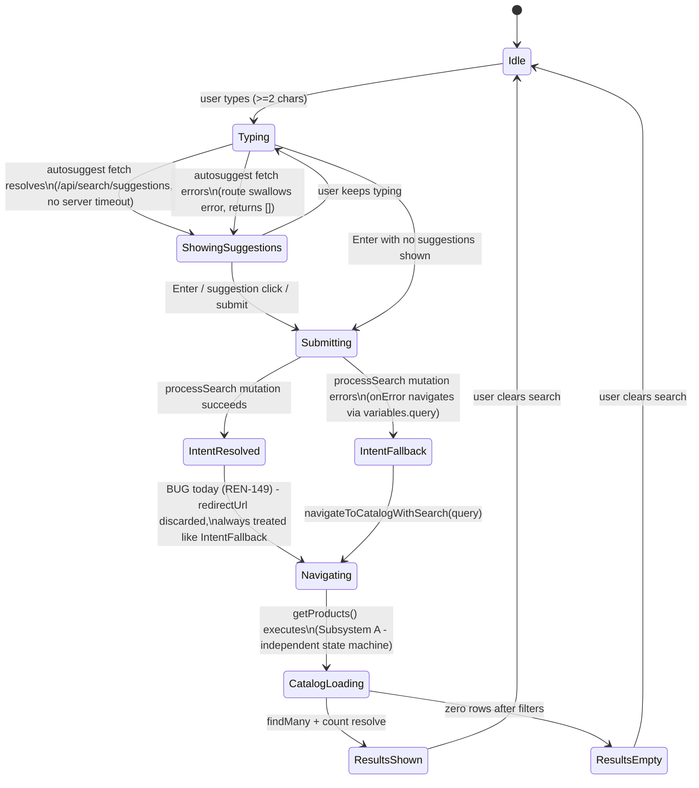

# State Machine — P01

The search bar UI (`product-search.tsx`) carries the only meaningful client-side state machine in this Epic's scope.

## Note on the REN-149 state collapse

Today, `IntentResolved` and `IntentFallback` both transition to the same `Navigating` behavior (`navigateToCatalogWithSearch`), because `onSuccess` never branches on `intentType`. The fix (REN-149) reintroduces a real branch at `IntentResolved`: navigate to `redirectUrl` for classified intents, and only fall through to `navigateToCatalogWithSearch` for `UNKNOWN` — collapsing two client states into one distinguishable-again state, matching what `04-architecture/SYSTEM_ARCHITECTURE.md`'s target diagram shows at node `E`.

## Server-side: no long-lived state machine

`getProducts()` and `processSearch()` are both stateless, single-request functions (CONFIRMED — no session/queue/multi-step server state). The "state machine" that matters here is entirely the sequence of synchronous/async decision points within one request, covered by `DATA_FLOW.md` above; there is no separate persistent workflow state to document.
