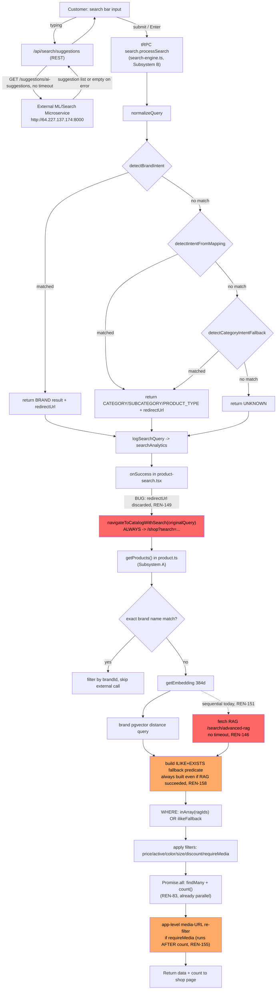
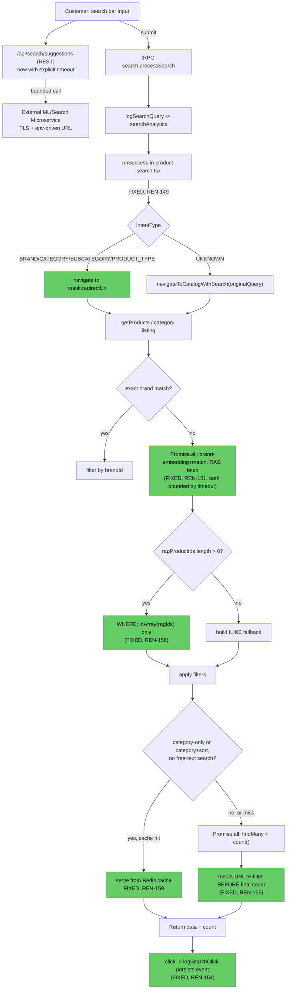

# System Architecture — P01

No target architecture document existed for search before this pass (CONFIRMED absence). This Epic hardens the existing architecture rather than redesigning it — the "current" and "target" diagrams below are nearly identical by design; differences are annotated.

## Current architecture (CONFIRMED)

Red = confirmed defect (behavior wrong). Orange = confirmed inefficiency (behavior correct, cost avoidable).

## Target architecture (post-Epic)

Only four edges change; everything else is identical to current-state, which is the point — this is hardening, not redesign.

Green = fixed by this Epic's issues.

## What is deliberately unchanged

- The external ML/search microservice itself: not replaced, not retrained, not brought in-house.
- The intent-classification priority order (brand → mapping table → fallback).
- The RAG-relevance-vs-explicit-sort suppression logic (`shouldApplySearchRelevanceOrdering`, SE-F002's existing fix).
- pgvector's role: still brand-matching only; product-level embeddings remain written-but-unused (no requirement in this Epic proposes activating them — see `07-feasibility/ALTERNATIVES.md`).
