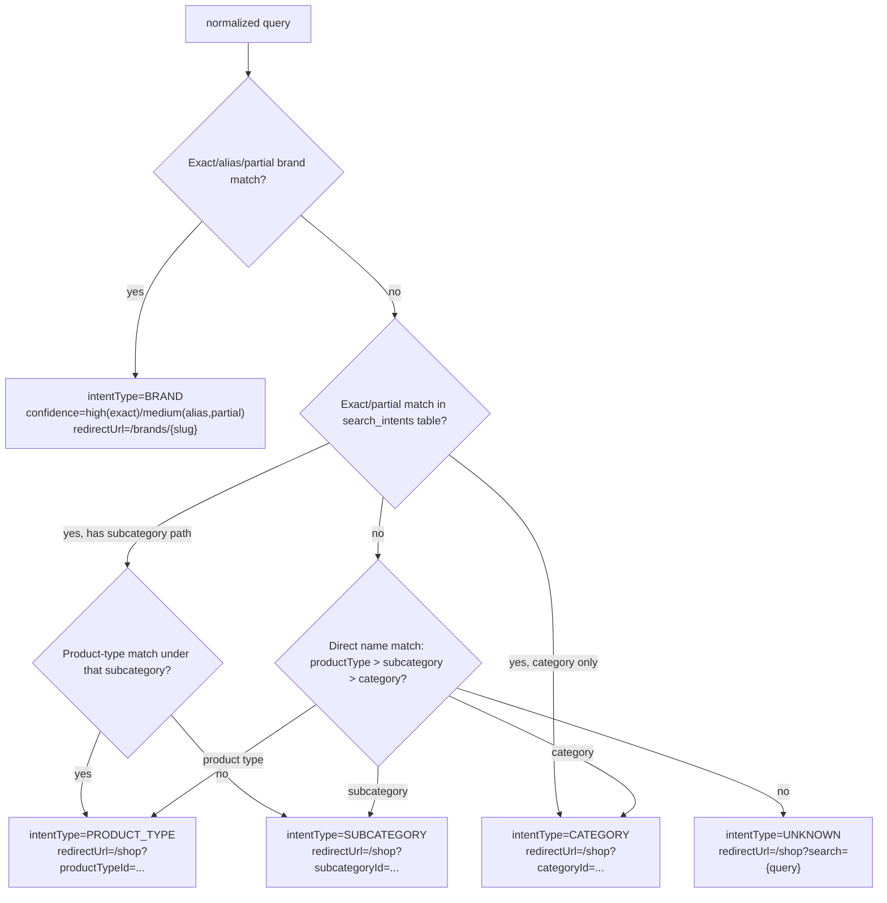

# Decision Logic — P01

## Intent classification decision tree (Subsystem B, CONFIRMED)



## Search-candidate decision logic (Subsystem A, CONFIRMED)

| Condition | Candidate source | External call made? |
|---|---|---|
| Query exactly matches an active brand name (case/whitespace-insensitive) | `brandId` filter only | No |
| Query does not exactly match a brand | Embedding + brand-distance query, RAG fetch | Yes (both, today sequential — REN-151) |
| RAG returns ≥1 candidate ID | `inArray(ragIds)` (today: `OR` ILIKE fallback too — REN-158 removes the OR) | — |
| RAG returns 0 candidates or errors | ILIKE/EXISTS fallback only | — |
| Brand-distance query finds a match < 0.28 | Brand-match ordering pin applied | — |
| Brand-distance query finds no match ≥ 0.28, or embedding call fails | No brand pin; RAG/ILIKE candidates unaffected | — |

## Ranking-order decision (`shouldApplySearchRelevanceOrdering`, CONFIRMED)

```
apply RAG relevance order  <=>  isRagSearchActive AND hasRagResults AND sortBy is not set
```
This is the entire SE-F002 fix — a single boolean gate. Nothing in this Epic proposes changing this gate; REN-158's ILIKE-removal and REN-151's parallelization both sit upstream of this decision and must not alter its inputs (`isRagSearchActive`, `ragProductIds.length`, `sortBy`) in a way that changes its output for the same request.

## Fallback-activation observability gap

There is currently no way to know, in aggregate, how often the ILIKE fallback actually fires vs. RAG succeeding (CONFIRMED — no counter/log aggregation exists beyond per-request `console.log`). This is exactly the data REN-167 (typo tolerance) is gated on, and that REN-154's logging work would need to additionally capture (not just click/result-count, but which candidate source won) if a future decision-maker wants to evaluate REN-167. Flagging as a **DECISION REQUIRED** scope question for whoever implements REN-154: should fallback-source be logged too, even though it's not in REN-154's stated title? Recommend yes, low incremental cost, high future value — see `10-roadmap/V2.md`.
