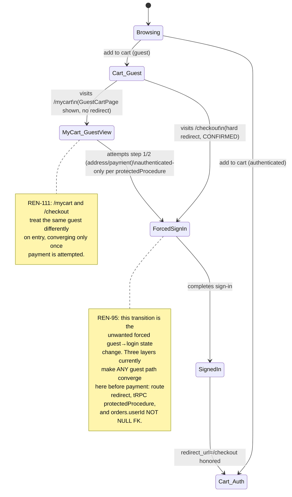
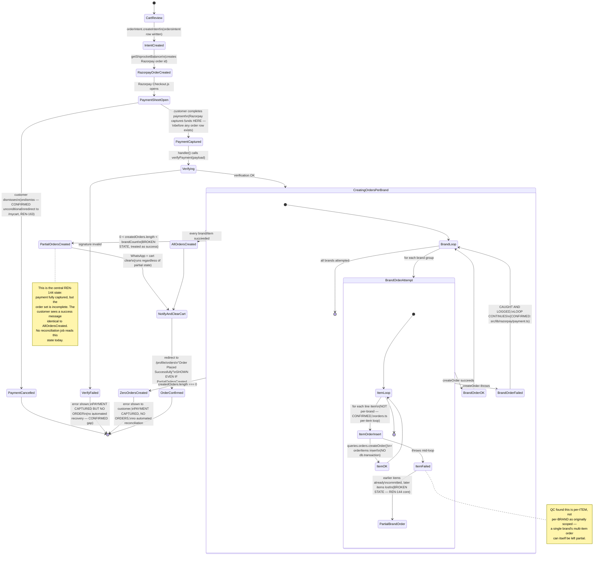
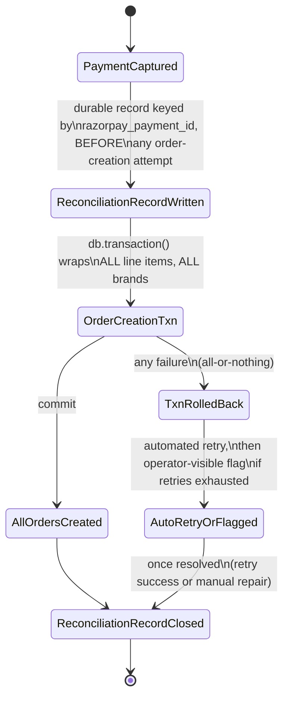

# State Machine — P05 Customer Journey & UX

This is the most important diagram in this Epic's package. It shows the real, current (broken) checkout/payment state machine, including the error states REN-144 introduces, and where REN-95's three enforcement layers force a guest into an unwanted state transition.

## Guest vs. authenticated entry (REN-95, REN-111)

## Checkout → payment → order state machine (REN-144 — the broken core)

## Target state machine (V1 fix direction — see `10-roadmap/V1.md`)

