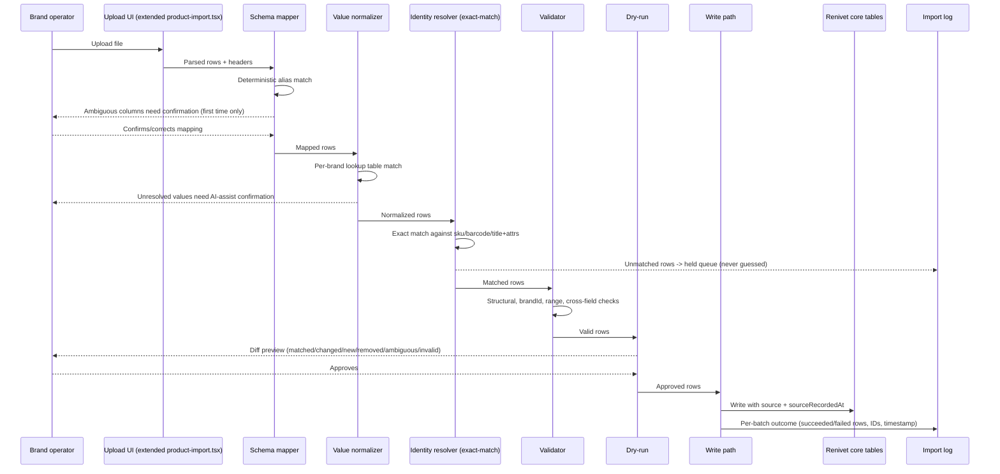
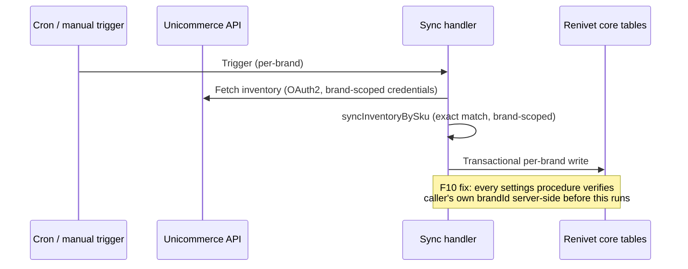

# Data Flow — P08 (V1)

## File-First path

## Existing Unicommerce path (unchanged except F10 fix)

## Provenance and audit data at rest

Every write from either path leaves: (1) a `source`/`sourceRecordedAt` pair on the affected row, and (2) for File-First, a per-batch log entry. This is the minimal provenance extension described in `06-data/DATA_REQUIREMENTS.md` — it is deliberately not the full reconciliation/audit spine (`06-sync-and-reconciliation/`), which remains Phase 2, gated.
