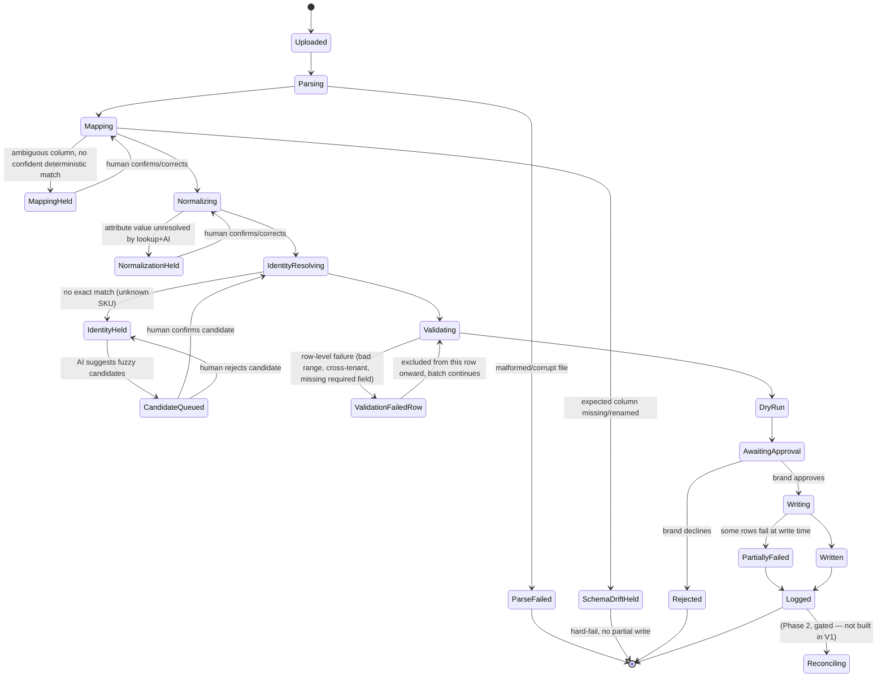

# State Machine — Ingestion Lifecycle (P08 V1)

Covers the File-First batch lifecycle: ingest → parse → map → validate → dry-run → approve → write → (reconcile is Phase 2, shown as a future state only). Explicit error/hold states are first-class, not exceptions.

## Hold states are terminal-per-row, not batch-blocking

`MappingHeld`, `NormalizationHeld`, `IdentityHeld`, `CandidateQueued`, and `ValidationFailedRow` isolate the affected row(s) without blocking the rest of the batch — this directly implements FR-16/NFR-3 (per-item isolation) and closes the current-state gap where one bad SKU can block or silently drop an entire brand's batch. (Research: `06-sync-and-reconciliation/` Failure Handling.)

## Explicit non-states in V1

There is no `Reconciling` state reachable in V1 — it is shown above only to mark where Phase 2's reconciliation spine would attach once its trigger fires (a second live source per brand). There is no auto-apply transition out of `IdentityHeld` or `CandidateQueued` — every exit from those states requires a human action, per BRule-1.
