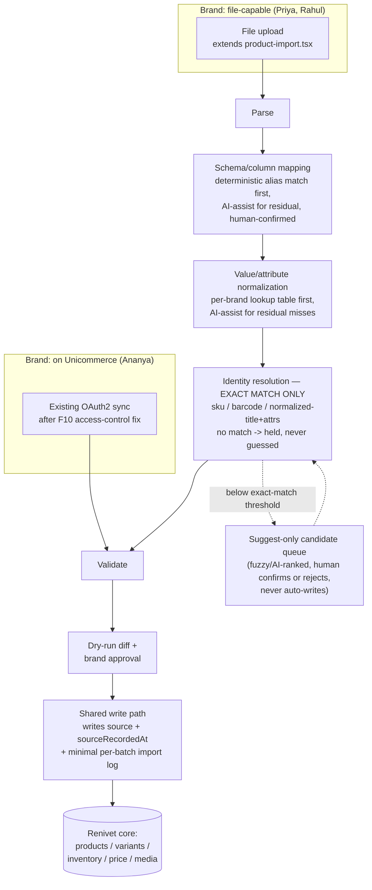
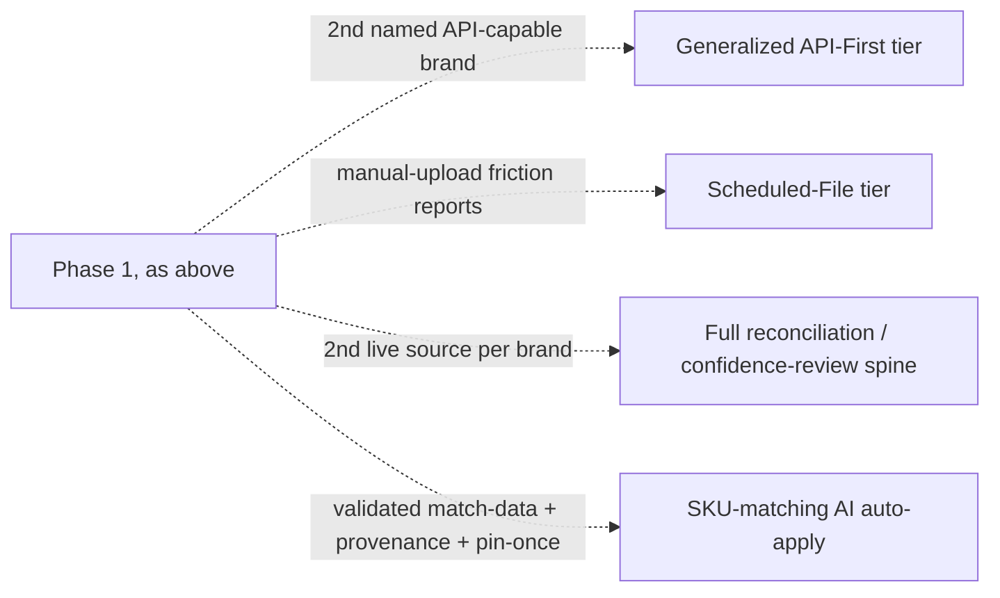

# System Architecture — P08

Source: `docs/research/brand-commerce-integration/16-final/RECOMMENDED_ARCHITECTURE.md`, reproduced here in this package's own words with a Mermaid diagram. The recommendation is a **Scoped Hybrid**: two entry paths (file upload, existing Unicommerce sync) converging on one shared write path, with Phase 2 components explicitly gated behind named triggers (see `10-roadmap/VERSION_TRIGGERS.md`) rather than scheduled.

## Phase 1 (V1) architecture diagram

## Phase 2 (deferred, gated — not part of V1)

## Component responsibilities (Phase 1)

| Component | Responsibility | Status |
|---|---|---|
| File-First ingestion | Extend `product-import.tsx` (post-`xlsx` upgrade) to route through the shared write path | BUILD |
| Minimal provenance extension | `source` + `sourceRecordedAt` columns generalized to variant/price/media; per-batch import log table | BUILD |
| Exact-match identity resolution (Tier 1) | `sku`, `barcode`, normalized-title+attributes exact match only | BUILD |
| Schema-mapping AI assist | Residual columns only, human-confirmed always | BUILD |
| Attribute-normalization AI assist | Per-brand-scoped lookup table, AI only on miss | BUILD |
| Anomaly explanation AI | Plain-language explanation after a deterministic rule fires; never the detector | BUILD |
| Suggest-only SKU candidate queue (Tier 3/4) | Fuzzy/AI-ranked candidates, human confirms/rejects, never auto-writes | BUILD |
| Unicommerce access-control fix (F10) | Per-procedure brand-ownership check | BUILD, immediate, independent |

## What Phase 1 deliberately does not touch

The existing Unicommerce sync's core sync logic is unchanged beyond the access-control fix. No generalized connector abstraction is introduced until a second API-capable brand is real. No confidence-tier UI, reconciliation dashboard, or audit-sampling surface exists in Phase 1.

## Why Hybrid, scoped down, not the full `HYBRID.md` design

`13-option-comparison/COMPARISON_MATRIX.md` scored Hybrid best-or-tied-best on 10/14 criteria but withheld a final verdict pending critic review, for three reasons, all subsequently addressed in `15-synthesis/SYNTHESIS.md` §4: (1) Hybrid is a composite whose score assumed File-First fully built plus a *fixed* (not vulnerable) Unicommerce tier — the fix is now an explicit, independent requirement (BRule-11); (2) the shared spine's execution risk was unscored — the critic pass scored the full spine DEFER (unmeasured demand) and the minimal provenance extension BUILD (cheap, low-regret) separately, rather than treating "the spine" as one all-or-nothing unit; (3) the program rule requiring critic review before declaring a winner has been satisfied by `14-critic/`. See `11-critique/ARCHITECTURE_CRITIQUE.md` for this package's carry-forward of that critique.
